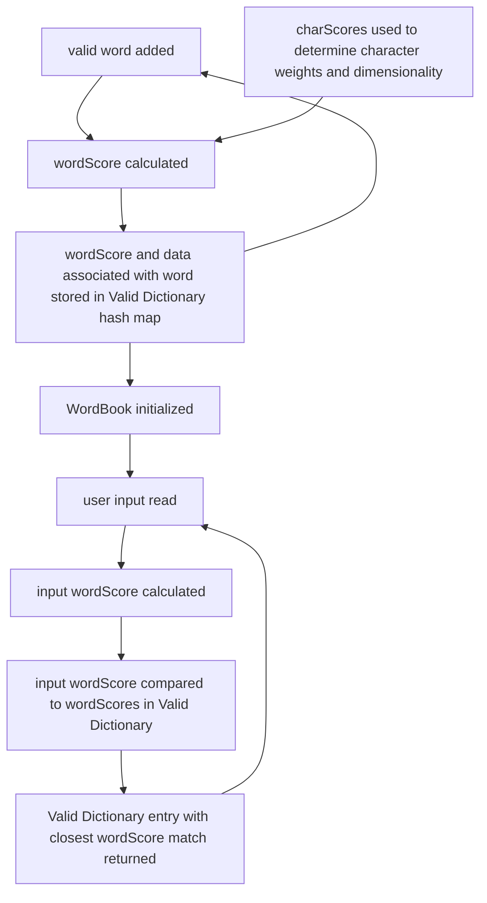

# Custom-Spellcheck
Takes a list of words specified by user and spellchecks input text to that dictionary

Flow Chart of Valid Word Initialization

  <b>Example:</b> 
  INPUT</b> 
  rgb = ColorWordBook[spellcheck("ponk", ColorWordBook, charScores)]["RGB"]</b> 
  OUTPUT</b> 
  rgb = ColorWordBook["pink"]["RGB"]</b> 
    

