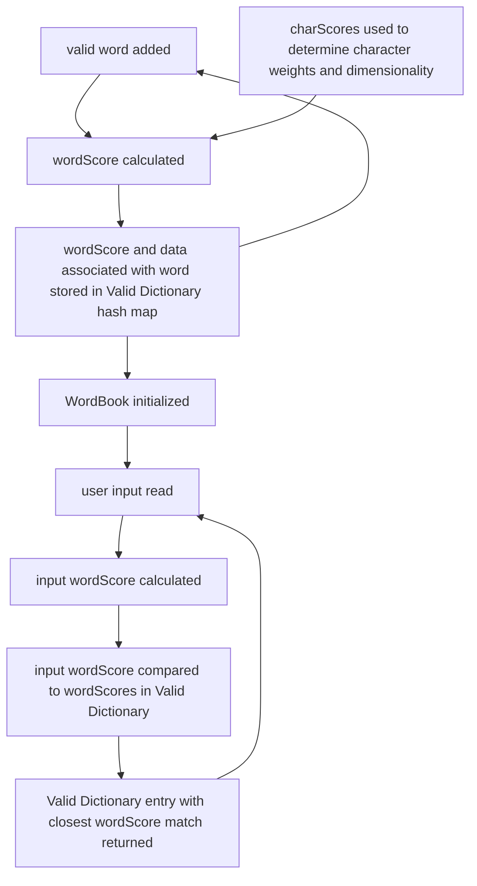

# Custom-Spellcheck
Takes a list of words specified by user and spellchecks input text to that dictionary

Flow Chart of Valid Word Initialization



  
<h3>Example (color_example.py):</h3>
```
import json

import custom_spellcheck as sc

# Get color information from colors.json
# Any json with the structure of words as keys, information of words in sub-keys is valid for import (double nested)
with open('colors.json', encoding="utf-8") as json_file:
    colors = json.load(json_file)

# Initialize the WordBook for colors
color_book = sc.WordBook()
color_book.add_dictionary_to_WordBook(colors)

# Check input "ponk" against the WordBook of Colors
rgb = color_book.spellcheck_word("ponk")

# The matching key in ColorBook
print(rgb[0])

# The dictionary containing all the information for that key
print(rgb[1])

# Get the RGB values in one line
print(color_book.spellcheck_word("ponk")[1]["RGB"])
```
  
<h3>Unchecked Input</h3>
INPUT (without Custom Spellcheck): `rgb = color_book["ponk"]["RGB"]`

OUTPUT: `Key Error`

<h3>Spellchecked Input</h3>

INPUT (with Custom Spellcheck): `rgb = color_book.spellcheckword("ponk")[1]["RGB"]`

OUTPUT: `rgb = color_book["pink"]["RGB"]`

Note: `color_book.spellcheckword("ponk")[1]` gets the information of the word (RGB in this case), 
`color_book.spellcheckword("ponk")[0]` is the word
